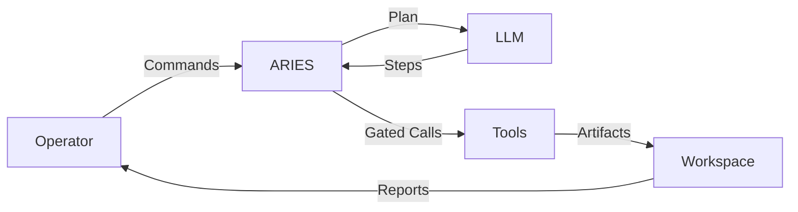
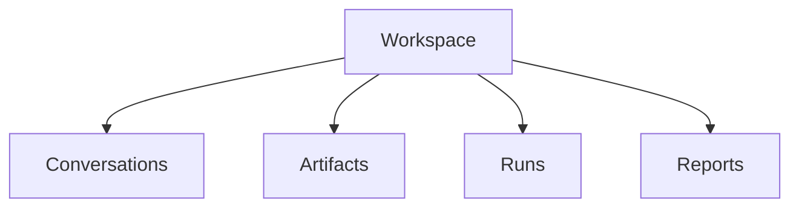
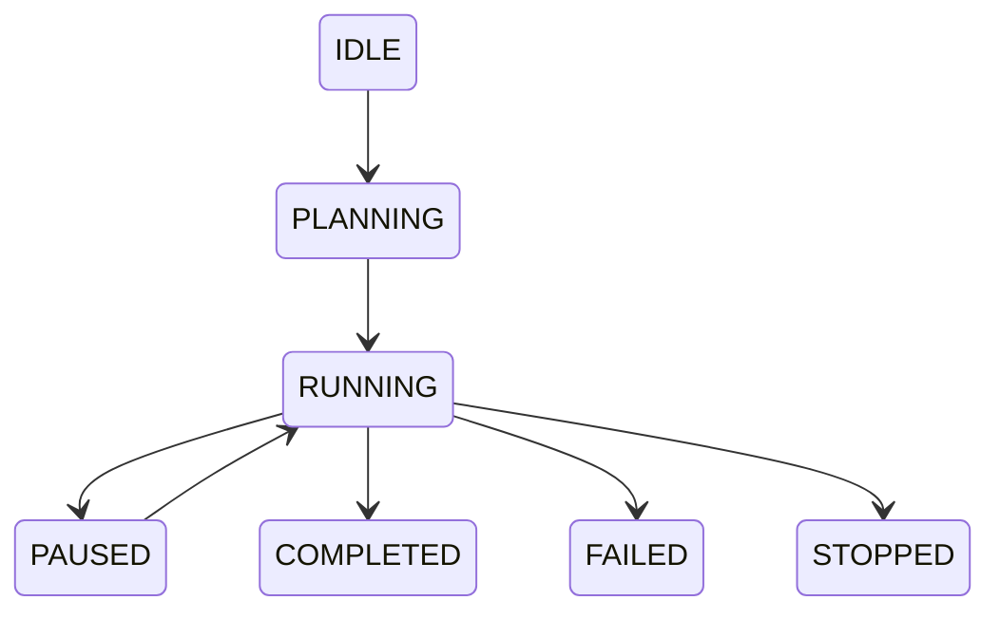
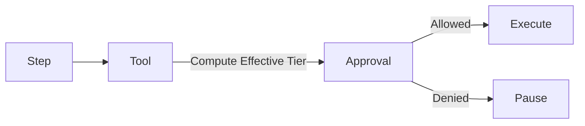
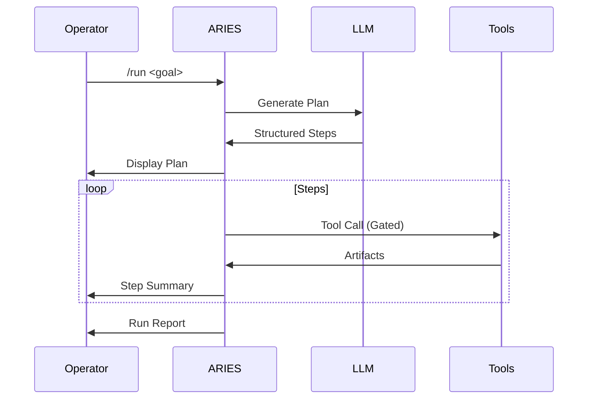
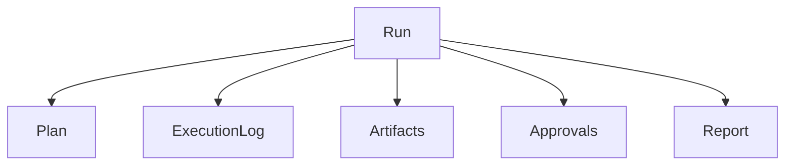
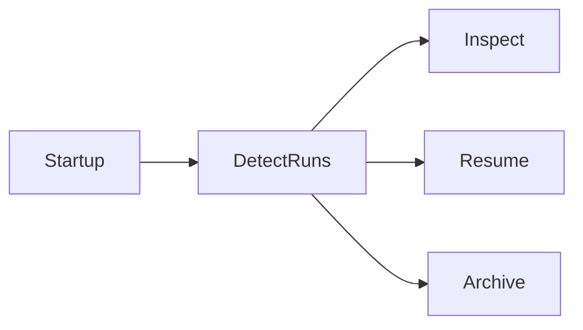

# ARIES — Agentic Research & Investigative Execution System

ARIES is a **terminal-native AI workbench** designed for **professional research, investigation, and operator-driven agent execution**.

Unlike typical chatbots or autonomous agents, ARIES is built for **humans who need to get work done**. It runs entirely on your local machine, using local AI models (via Ollama) to help you research, code, and analyze data with full transparency and control.

### What can ARIES do?
*   **Local-First Chat:** Talk to powerful LLMs without your data leaving your machine.
*   **Talk to your Data (RAG):** Index folders or PDFs and ask the AI questions about them.
*   **Web Search:** Search the internet and get summarized answers (via SearXNG).
*   **Guided Execution:** Use `/run` to let the AI build and execute a step-by-step plan for complex tasks.
*   **Full Control:** Every tool call and file edit requires your approval. No "black box" behavior.

---

## ⚡ Quick Start

### 1. Prerequisites
*   **Python 3.11+**
*   **Ollama:** Install from [ollama.com](https://ollama.com) and pull a model (e.g., `ollama pull llama3`).

### 2. Installation
```bash
# Clone the repo and install dependencies
git clone https://github.com/your-repo/aries.git
cd aries
pip install -e .
```

**Optional extras**

- Runtime with RAG features: `pip install -e ".[rag]"`
- Developer tools only: `pip install -e ".[dev]"`
- Everything (dev + RAG): `pip install -e ".[dev,rag]"`

### 3. Configuration
Copy the example config and check your settings:
```bash
cp config.example.yaml config.yaml
```

### 4. Run Aries
```bash
python -m aries
```

For a detailed manual on commands and workflows, check out the **[User Guide](./USER_GUIDE.md)**.

---

## Core Philosophy

ARIES is built on four principles:

1. **Operator First**
   - Every action is visible
   - Nothing executes silently
   - Human intent always gates execution

2. **Inspectable by Default**
   - Plans, steps, tools, approvals, artifacts, and reports are reviewable
   - Runs are persistent and recoverable
   - Output withstands professional scrutiny

3. **Workbench, Not Autonomy**
   - ARIES helps you *do the work*
   - It does not decide goals, ethics, or outcomes
   - No hidden background agents

4. **MCP as a First-Class Execution Layer**
   - Desktop Commander and Playwright integrated directly
   - External interaction is deliberate, gated, and traceable

---

## High-Level Architecture



---

## Core Concepts

### Workspaces

A workspace is a **persistent working environment**.

```bash
/ workspace open my_case
```

Each workspace contains:
- Conversation history
- Artifacts
- Run metadata
- Reports



---

### Profiles

Profiles define **how the model reasons and communicates**.

```bash
/ profile use investigator
```

Profiles control:
- Tone
- Methodology
- Output structure
- Assumptions

---

### Agent Runs

A **run** is a structured execution session.



Runs are:
- Stepwise
- Interruptible
- Inspectable
- Recoverable

---

## Approval Model

ARIES uses **risk tiers** instead of complex policy engines.

| Tier | Description |
|----|------------|
| 0 | Read-only analysis |
| 1 | Workspace-scoped writes |
| 2 | Desktop Commander / shell |
| 3 | Playwright / network |



Approvals are:
- Explicit
- Explainable
- Scoped (`once` or `session`)
- Logged

---

## Typical Workflow



---

## Inspecting and Controlling Runs

### Inspect

```bash
/ run inspect
```

Displays:
- Plan
- Step status
- Approvals
- Artifacts

Read-only view.

---

### Manual Stepping

```bash
/ run next
/ run continue
```

Manual stepping is ideal for:
- Desktop automation
- Browser navigation
- High-risk OSINT actions

---

### Editing a Plan

```bash
/ run pause
/ run edit
```

Operators can:
- Rename steps
- Adjust intent
- Reorder steps
- Change risk tiers

All edits are audited.

---

## Artifacts

Artifacts are outputs from tools and analysis.

```bash
/ artifacts run
/ artifact open <id>
```

Artifacts are always traceable to:
- Step
- Tool
- Run

---

## Run Reports

Every run generates:

- Markdown report
- JSON report



Reports are suitable for:
- Case files
- Client deliverables
- Legal review

---

## Run Recovery

On startup, ARIES detects incomplete runs.



Nothing resumes automatically.

---

## Example Scenarios

### OSINT Investigation
- Investigator profile
- Playwright browsing
- Structured reporting

### Desktop Evidence Collection
- Manual stepping
- Desktop Commander
- Traceable artifacts

### Technical Research
- Tier 0 analysis
- Documentation synthesis

---

## Design Guardrails

ARIES intentionally avoids:
- Autonomous agents
- Background schedulers
- Policy engines
- Web dashboards

ARIES prioritizes:
- Transparency
- Control
- Professional rigor

---

## Status

ARIES is operational and under active development.
It prioritizes correctness, control, and inspectability over novelty.

---

## License

[Add license here]
