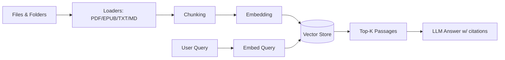
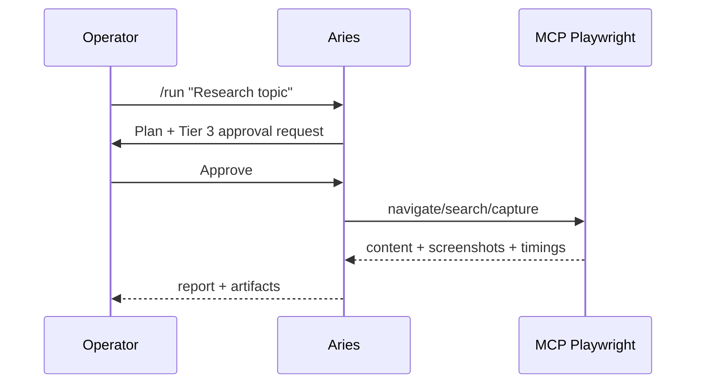
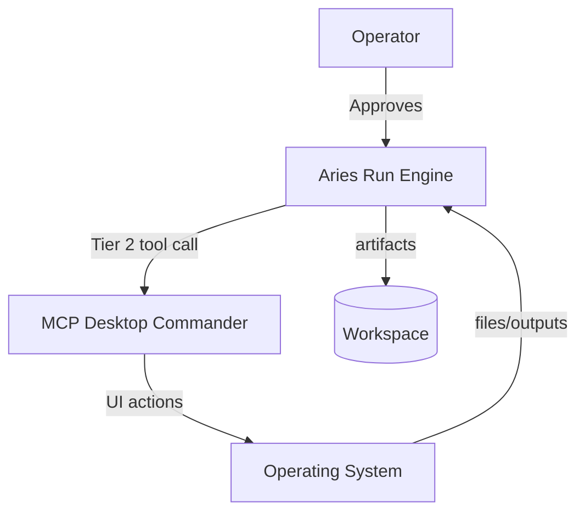

# Aries User Guide
*Get Things Done: local-first research, investigation, coding, and automation*

> Aries is a command-line AI assistant that runs locally and connects to local models (e.g., Ollama). It can:  
> - Chat and reason with your context  
> - Use tools (filesystem, shell, web search)  
> - Run multi-step agent plans (`/run`) with risk-tier approvals  
> - Add **RAG** (chat with your documents) as an optional capability  
> - Integrate **MCP Playwright** (browser automation) and **MCP Desktop Commander** (desktop control) when enabled

This guide is written to be practical and “operator-first”: you get visibility, you stay in control, and nothing silently mutates state without explicit approval.

---

## Table of Contents
1. [Quickstart](#quickstart)  
2. [Smoke Test (Windows)](#smoke-test-windows)  
3. [Core Concepts](#core-concepts)  
4. [Installation & Dependencies](#installation--dependencies)  
5. [Configuration](#configuration)  
6. [Everyday Usage](#everyday-usage)  
7. [Workspaces](#workspaces)  
8. [Profiles](#profiles)  
9. [Agent Runs (`/run`)](#agent-runs-run)  
10. [RAG: Chat with Your Documents](#rag-chat-with-your-documents)  
11. [Direct Tooling](#direct-tooling)  
12. [Playwright Integration (MCP)](#playwright-integration-mcp)  
13. [Desktop Commander Integration (MCP)](#desktop-commander-integration-mcp)  
14. [Artifacts](#artifacts)  
15. [Troubleshooting & Diagnostics](#troubleshooting--diagnostics)  
16. [Security, Safety, and Governance](#security-safety-and-governance)  
17. [Appendix: Example Workflows](#appendix-example-workflows)

---

## Quickstart

### Prerequisites
- **Python 3.11–3.13** (best wheel coverage on Windows; 3.14 is not supported yet)
- **Ollama** installed and running
  - Pull a model: `ollama pull llama3` (or another model you prefer)

### Install (Base)
From the repo root:

#### macOS/Linux
```bash
python -m venv .venv
source .venv/bin/activate
python -m pip install -U pip
pip install -e .
```

#### Windows PowerShell
```powershell
python -m venv .venv
Set-ExecutionPolicy -Scope Process -ExecutionPolicy Bypass
.\.venv\Scripts\Activate.ps1
python -m pip install -U pip
pip install -e .
```

> **Note:** Local environment/build outputs (for example `.venv*`, `build/`, or `*.egg-info/`) are generated artifacts and should not be committed to version control.

### Start Aries
Preferred (all platforms):
```bash
aries
```

Fallback launchers (helpful if entrypoints are not on PATH):
- Windows PowerShell: `.\aries.ps1`
- macOS/Linux: `./aries.sh`

These scripts prefer the project virtual environment when present and avoid platform-specific command differences.

```bash
python -m aries
```

### Verify
Inside Aries:
```text
/help
/model list
/policy
```

### Enable Desktop Ops (Optional)
1. Configure a Desktop Commander MCP server in `providers.mcp.servers`.
2. Set `desktop_ops.enabled: true` and `desktop_ops.server_id` to match the MCP server id.
3. Run `/desktop <goal>` to execute Desktop Ops workflows.

---

## Smoke Test (Windows)

Run a one-command, operator-friendly smoke test that validates the built-in filesystem, shell, and web tools:

```powershell
python -m aries --smoke
```

The smoke test:
- Creates/opens the `smoke` workspace
- Exercises Desktop Ops policy flow with **builtin** FS/Shell/Web tools
- Writes a small text file under `desktop_ops.allowed_roots`
- Runs a harmless shell command via argv
- Executes a SearXNG search + fetch + extract against `example.com`
- Confirms artifacts + Desktop Ops audit logs land in the workspace artifacts directory

### Prerequisites
- SearXNG running and reachable at `search.searxng_url`
- `desktop_ops.allowed_roots` configured to a safe local directory

### Example Windows Config Snippet
```yaml
desktop_ops:
  allowed_roots:
    - "C:\\Users\\yourname\\Dev\\aries"
tools:
  allow_shell: true
  allow_network: true
search:
  searxng_url: "http://localhost:8080"
providers:
  builtin:
    enabled: true
  mcp:
    enabled: false
```

> Smoke mode uses a narrow, in-memory auto-approval allowlist just for the smoke run. It does **not** change your default security settings on disk.

---

## Core Concepts

### What Aries Is (and Is Not)
- **Is:** a local CLI agent with explicit tool invocation and operator approval for risky actions.
- **Is not:** an autonomous background scheduler or “hands-off” automation system.

### Operator-First Execution
Aries prioritizes:
- **Visibility**: clear status lines, reports, and error messages
- **Control**: approvals, manual stepping, skip/retry, and run inspection
- **Recoverability**: runs persist and can be resumed/inspected

### Risk Tiers (Mental Model)
Aries uses tiers to help you decide what to approve. A simplified mapping:

| Tier | Typical meaning | Examples |
|---:|---|---|
| 0 | Read-only / analysis | reading files, local parsing, retrieval |
| 1 | Workspace-scoped writes | writing artifacts in workspace |
| 2 | Shell / desktop control | shell commands, desktop actions |
| 3 | Network/browser automation | Playwright/browser automation, networked tools |

In practice, Aries may compute an **effective tier** as the maximum of the plan step’s tier and the tool’s tier.

---

## Installation & Dependencies

Aries supports optional “extras” so you can keep the base install lightweight.

### Recommended Install Targets

| Goal | Install |
|---|---|
| Just run Aries (CLI + core tools) | `pip install -e .` |
| Development tooling + tests | `pip install -e ".[dev]"` |
| RAG capability (document indexing & retrieval) | `pip install -e ".[rag]"` |
| Everything (recommended for power users) | `pip install -e ".[dev,rag]"` |

If the `[rag]` extra is not installed, `/rag` commands print a friendly reminder instead of failing so you can opt in later.

### Windows Notes: Avoiding Painful Builds
Some Python package sets may try to compile native dependencies on Windows if wheels aren’t available for your Python version.
- If you hit compiler errors (e.g., missing Visual Studio Build Tools), consider:
  - Using **Python 3.11–3.13** instead of bleeding-edge versions
  - Installing the “all wheels friendly” combo first: `pip install -U pip setuptools wheel`
  - Installing in two phases: base first, then extras

### Proxy/Corporate Network Notes
If your environment blocks PyPI traffic or uses a proxy:
- Set `PIP_INDEX_URL` / `PIP_EXTRA_INDEX_URL` (or configure `pip.ini`)
- If TLS inspection is present, you may need corporate root cert configuration

---

## Configuration

Aries uses YAML configuration (typically `config.yaml`).

### Minimal Example
```yaml
ollama_base_url: "http://localhost:11434"
default_model: "llama3"
confirmation_required: true
allow_shell: true
allow_network: true
allowed_roots:
  - "C:\\Users\\yourname\\Dev\\aries"
```

### Key Settings
- `ollama_base_url`: Ollama server address
- `default_model`: startup model
- `confirmation_required`: whether approvals are enforced for risky tool calls
- `allow_shell`: enable shell tool
- `allow_network`: enable web search / networked tools (and browser automation if configured)
- `allowed_roots`: filesystem roots Aries is permitted to access

### Verify Policy
Inside Aries:
```text
/policy
```

---

## Everyday Usage

### Chat
Just type and press Enter:
```text
Summarize the key risks in this plan and suggest mitigations.
```

### Clear Context
```text
/clear
```

### Exit
```text
/exit
```

### Switch Models
```text
/model list
/model set llama3
```

---

## Workspaces

Workspaces let you separate projects and persist:
- chat history
- run state
- artifacts
- RAG indices (when enabled)

### Common Commands
```text
/workspace list
/workspace new client_x
/workspace open client_x
```

---

## Profiles

Profiles are “system prompt personas” + defaults that shape behavior.
Use profiles to set tone and domain constraints (e.g., investigator, coder).

```text
/profile list
/profile use investigator
```

---

## Agent Runs (`/run`)

Agent runs are structured multi-step executions:
1. Plan generation
2. Stepwise execution
3. Tool usage with tier enforcement + approvals
4. Persisted status and reporting

### Start a Run
```text
/run "Create a structured intake form template and save it to the workspace."
```

### Monitor
```text
/run status
/run steps
```

### Operator Controls
```text
/run pause
/run resume
/run skip 3
/run retry 3
/run stop
```

### Manual Stepping vs Auto
When enabled:
```text
/run next       # execute a single step then pause
/run continue   # resume automatic sequential execution
```

### Inspect Any Run
```text
/run inspect
/run inspect <run_id>
```

---

## RAG: Chat with Your Documents

RAG (Retrieval-Augmented Generation) allows Aries to index local files and retrieve relevant passages during answers.

### 1) Install RAG Dependencies
```bash
pip install -e ".[rag]"
```
If you want dev tooling plus RAG:
```bash
pip install -e ".[dev,rag]"
```

### 2) Confirm RAG is Available
Inside Aries:
```text
/help /rag
/rag list
```
If you see a message indicating optional dependencies are missing, install the `[rag]` extra.

### 3) Index a Folder
```text
/rag add C:\path\to\docs
```
Depending on your build, you may also see:
```text
/rag index add C:\path\to\docs
```

### 4) Select an Index (If Needed)
```text
/rag use <index_name>
```

### 5) Ask Questions
```text
Summarize the surveillance tradecraft principles in the indexed folder.
List any recommended checklists and their intended use.
```

### RAG Pipeline (Diagram)


---

## Direct Tooling
Use `/last` for debugging tool calls and model payloads:
```text
/last
```

---

## Playwright Integration (MCP)

Playwright via MCP enables browser automation for web research and navigation.

### Requirements
- MCP Playwright provider configured
- `allow_network: true`
- Operator approvals for Tier 3 actions

### Browser Automation (Diagram)


---

## Desktop Commander Integration (MCP)

Desktop Commander enables controlled desktop actions (Tier 2 in most setups).

### Requirements
- MCP Desktop Commander provider configured
- `allow_shell` often recommended
- Operator approvals (Tier 2)

### Desktop Control (Diagram)


---

## Artifacts
```text
/artifacts
/artifacts run <run_id>
/artifact open <id>
```

---

## Troubleshooting & Diagnostics

### “Nothing happened” / Blank output
- Use `/last`
- Switch models: `/model set llama3`
- Rephrase prompts to be more directive

### Missing dependencies
Install the right extra:
- Base: `pip install -e .`
- Dev: `pip install -e ".[dev]"`
- RAG: `pip install -e ".[rag]"`

### PowerShell gotcha: `||`
PowerShell doesn’t support `cmd.exe`-style `||`.

Use:
```powershell
pip install -e ".[dev]"
# or:
pip install -e .
```

### Tool access denied (roots)
Update `allowed_roots` in `config.yaml`, then verify with `/policy`.

---

## Security, Safety, and Governance
- Keep `confirmation_required: true`
- Minimize `allowed_roots`
- Use separate workspaces per client/project
- Treat RAG corpora as sensitive
- Desktop Ops enforces workspace boundary checks and mode-aware approvals.
- Destructive, privileged, and networked Desktop Ops actions always require explicit approval.

---

## Appendix: Example Workflows

### PI-style brief (local + web)
1. `/workspace new case_foo`
2. `/rag add .\evidence` (optional)
3. `/search "subject name + city"`
4. `/run "Produce an OSINT brief with timeline and sources."`

### Software project deep-dive (RAG)
1. `/workspace new project_bar`
2. `/rag add .\repo`
3. Ask: `Explain the run persistence model.`
